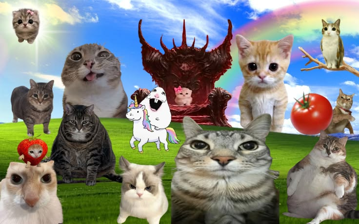

## Hi there 👋

# 👨‍💻 System & Software Engineering

I am a Computer Science undergraduate with a profound interest in low-level architecture, systems programming, and software automation. My focus lies in understanding the complete computational stack—from hardware logic gates and assembly registers to high-level application development.

---

### 🔬 Technical Arsenal

**Languages & Low-Level**

**Frameworks, Libraries & Tools**

**Core Competencies**
`Data Structures & Algorithms` | `Object-Oriented Design` | `Computer Architecture` | `Quality Assurance (Testing)`

---

### 🚀 Current Endeavors

- ⚙️ **Systems & Hardware:** Deep diving into 8-bit computer architecture, breadboard logic, and register-level operations.
- 🎮 **Engine Development:** Developing a 2D platformer game engine utilizing **C++** and the **SFML** library.
- 🧪 **Software Testing:** Applying quality assurance methodologies in real-world software testing environments.
- 🧠 **Algorithmic Problem Solving:** Preparing for competitive programming and ICPC challenges.

---

### 📊 System Analytics

  
  

<!-- 
💡 How to contact me: 
Uncomment and add your professional email or LinkedIn below if desired.
-->
